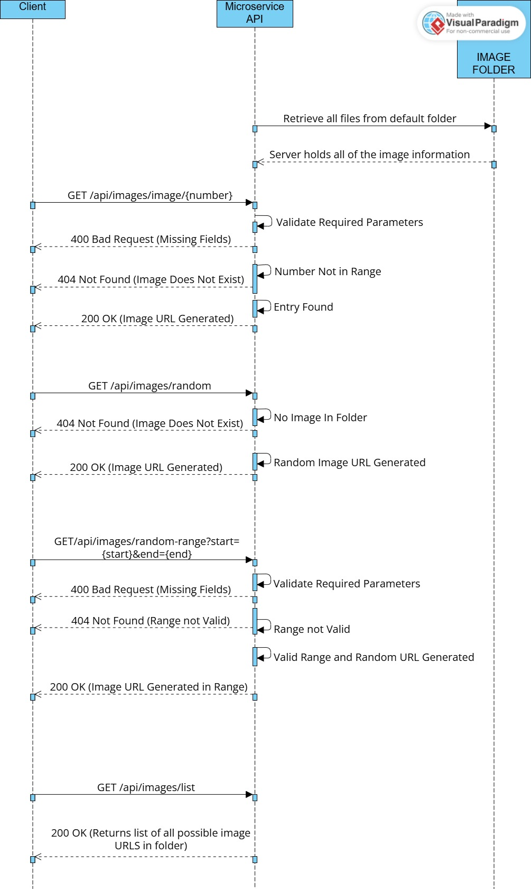

# Number Image Microservice

This microservice provides a REST API to:
- Get the file path to a specific image by number
- Get a random image path
- Get a random image path within a range
- List all available image paths in a pre-defined folder

---

**Replace DEFAULT_IMAGE_PATH in defaultPath.js**

- Replace the DEFAULT_IMAGE_PATH with the folder you have your images in

---

## Endpoints


### 1. Get Image by Number

**Request:**  
GET /api/images/image/{number}  

**Parameters:**  
- number (required): the image number.

**Responses:**
- 200 code  
  ```json
  { "imagePath": "DEFAULT_IMAGE_PATH/image-1.jpg" }
  ```
- 400 error code if no image number provided.
- 404 error code if image number not found.

**Example:**
```python
import requests

response = requests.get('http://localhost:3000/api/images/image/1')

data = response.json()
print(data) # Prints the full response
print(response.json().get("imagePath")) # Prints the image path
```

---

### 2. Get a Random Image

**Request:**  
GET /api/images/random

**Parameters:**  
None

**Responses:**
- 200 code 
  ```json
  { "imagePath": "DEFAULT_IMAGE_PATH/image-3.jpg" }
  ```
- 404 error if no image available in the default folder.

**Example:**
```python
import requests

response = requests.get('http://localhost:3000/api/images/random')

data = response.json()
print(data) # Prints the full response
print(response.json().get("imagePath")) # Prints the image path
```

---

### 3. Get a Random Image in a Range

**Request:**  
GET /api/images/random-range?start={start}&end={end}

**Parameters:**  
- start (required): start of the range.
- end (required): end of the range.

**Responses:**
- 200 code  
  ```json
  { "imagePath": "DEFAULT_IMAGE_PATH/image-4.jpg" }
  ```
- 400 error code if missing start and/or end parameter.
- 404 error code if no image found in the given range.

**Example:**
```python
import requests

response = requests.get('http://localhost:3000/api/images/random-range?start=2&end=5')

data = response.json()
print(data) # Prints the full response
print(data.get("imagePath")) # Prints the image path
```

---

### 4. List All Available Images

**Request:**  
GET /api/images/list

**Parameters:**  
None

**Responses:**
- 200 code  
  ```json
  {
    "images": [
      "DEFAULT_IMAGE_PATH/image-1.jpg",
      "DEFAULT_IMAGE_PATH/image-2.jpg",
      "DEFAULT_IMAGE_PATH/image-3.jpg"
    ]
  }
  ```

**Example:**
```python
import requests

response = requests.get('http://localhost:3000/api/images/list')

data = response.json()
print(data)  # Prints the full response
print(data.get("images"))  # Prints the list of image paths

# Print each image path individually
for img in data.get("images", []):
    print(img)
```

---

## Installation and Running the Server

1. **Install dependencies**  

   Open Command Prompt in the project directory and run:

   npm install


2. **Start the server**  

   In Command Prompt, run:

   node src/app.js

The server will start at `http://localhost:3000`.

